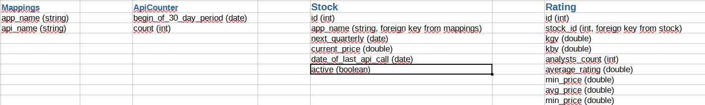
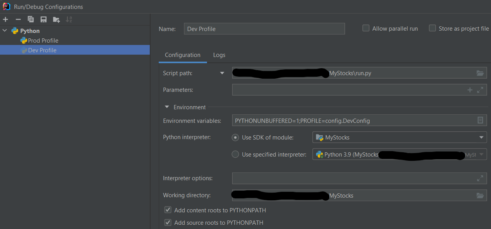

# MyStocks

## Business Domain

### Core Domain
This project serves as backend for monitoring personal stocks. In order to do so
it requests information from the API of yahoo available at    

https://rapidapi.com/apidojo/api/yh-finance/

The response is then processed such that relevant information is retrieved and
returned to the frontend app. Note that in order not to invoke the external API on each
request we save the data in a local database which acts as a cache for subsequent invocations.
Thus, we only synchronize with yh-finance API in the following cases:  
  - New stocks shall be monitored
  - Information for a given stock has not been updated for some time (e.g. 3 days)

The general concept is illustrated in the following runtime view:    


    
### Usecases
Next to the core usecase described in the previous chapter, the following features are provided:  
- administrative task: map displayed stock names to API params (CRUD /mapping)
- administrative task: provide possibility to upload csv of mappings
- administrative task: database import and export
- choose which of the stocks (registered in mappings) should be shown and requested (/stocks)
- frontend: highlight underrated stocks
- frontend: exclamation mark on stock when quarterlies are close or rating has changed
    
### External API
We request yh-finance to receive up-to-date information regarding our stocks of interest. Since we stick
to the free plan, we can only fire 500 request a month against said API. We thus only call yh-finance
if the information for a given entry in the database has not been updated in the last three days. Still, once
many stocks are shown in our app, we might still hit 500 API calls in a given month. For that purpose
we count the number of calls per month and stop hitting the API once we are close to 500.

### Database Schema
The diagram below illustrates the schema of our stocks database:    


## Local Setup

### Setting up dependencies
Create a virtual environment either via command line or if using IntelliJ in terms of a new project SDK
and configure to use it in Project Structure. Using IntelliJ you can now open requirements.txt and simply
follow the suggestion to install the specified dependencies. As the new virtual environment ist configured 
as project SDK, the corresponding packages will be automatically installed in the right location within the virtual
environment, i.e. site-packages. Otherwise, using command line you need to activate the virtual environment explicitly
and then install the dependencies via pip thereby passing the requirements.txt file as a parameter to the 
pip install command.

### Running the project
In order to run the project locally, you need to install docker and start the postgres database
from the root directory of the project using ```docker-compose up```    
Further, there are two profiles - dev and local - to run the application (note that the former uses mock
data instead of actually requesting information from yh-finance). They are configured in terms of config.py.
The profiles can be activated by configuring corresponding runners. The configuration for e.g. the dev profile
in IntelliJ looks as follows:


