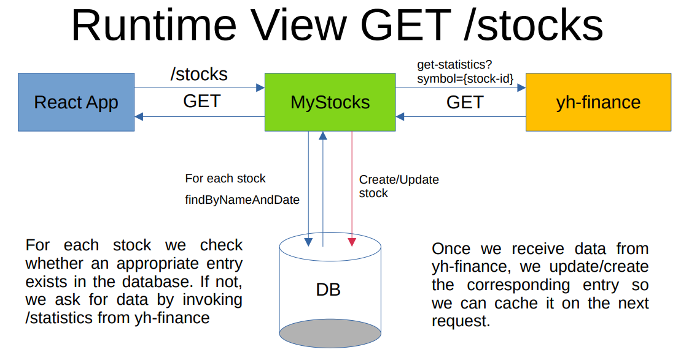
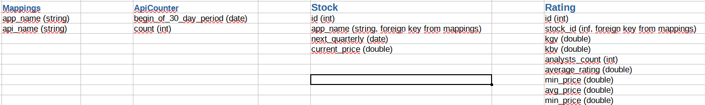

# MyStocks

### Core Domain
This project serves as backend for monitoring personal stocks. In order to do so
it requests information from the API of yahoo available at    

https://rapidapi.com/apidojo/api/yh-finance/

The response is then processed such that relevant information is retrieved and
returned to the frontend app. Note that in order not to invoke the external API on each
request we save the data in a local database which acts as a cache for subsequent invocations.
Thus, we only synchronize with yh-finance API in the following cases:  
  - New stocks shall be monitored
  - Information for a given stock has not been updated for some time (e.g. 3 days)

The general concept is illustrated in the following runtime view:    

    
### Usecases
Next to the core usecase described in the previous chapter, the following features are provided:  
- administrative task: map displayed stock names to API params (CRUD /mapping)
- administrative task: provide possibility to upload csv of mappings
- administrative task: database import and export
- choose which of the stocks (registered in mappings) should be shown and requested (/stocks)
- frontend: highlight underrated stocks
- frontend: exclamation mark on stock when quarterlies are close or rating has changed
    
### External API
We request yh-finance to receive up-to-date information regarding our stocks of interest. Since we stick
to the free plan, we can only fire 500 request a month against said API. We thus only call yh-finance
if the information for a given entry in the database has not been updated in the last three days. Still, once
many stocks are shown in our app, we might still hit 500 API calls in a given month. For that purpose
we count the number of calls per month and stop hitting the API once we are close to 500.

### Database Schema
The diagram below illustrates the schema of our stocks database:    
